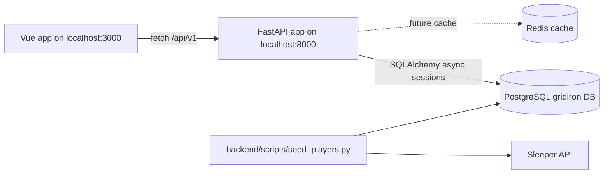

# Gridiron Labs Architecture

## Current architecture summary

Gridiron Labs is a monorepo with:

- a **frontend** built with Vite, Vue 3, TypeScript, Vuetify, and TanStack Query;
- a **backend** built with FastAPI, SQLAlchemy async sessions, Alembic migrations, PostgreSQL, and Redis;
- a **database** with users, players, rosters, and lineups;
- a **mock scoring service** that produces deterministic Gridiron Grade values until real football data is integrated.

## Repository layout

```txt
gridiron-labs/
├── frontend/
│   ├── src/
│   │   ├── components/layout/  # Page and dashboard components
│   │   ├── composables/        # Data-fetching composables and reusable Vue composition helpers
│   │   ├── lib/                # API client and utilities
│   │   ├── plugins/            # Vue plugin registration
│   │   └── types/              # Frontend TypeScript contracts
│   ├── package.json
│   ├── vite.config.ts
│   └── tsconfig*.json
├── backend/
│   ├── app/
│   │   ├── api/routes/         # FastAPI route modules
│   │   ├── core/               # Config and database session setup
│   │   ├── models/             # SQLAlchemy ORM models
│   │   ├── schemas/            # Currently empty; future Pydantic schemas
│   │   ├── services/           # Gridiron scoring and mock data logic
│   │   └── main.py             # FastAPI app entry point
│   ├── db/                     # Alembic migrations
│   ├── scripts/                # Seed scripts
│   └── requirements.txt
├── docker-compose.yml
├── README.md
└── gridiron-labs-context.md
```

## Runtime architecture



## Frontend architecture

### Current stack

- Vite
- Vue 3
- TypeScript
- Vuetify
- TanStack Query
- No frontend router is used; current navigation is local app state.
- No global store is currently used.

### Current screens

#### `frontend/src/components/layout/ControlCenterShell.vue`

Responsibilities:

- orchestrate the player pool, active lineup board, and roster bench
- manage search and position filter state
- display player details

Key composables:

- `usePlayers(position, search)`

#### Supporting layout components

- `frontend/src/components/layout/PlayerPool.vue`

### API client

`frontend/src/lib/api.ts` defines a generic `apiFetch<T>()` wrapper.

Current behavior:

- base URL comes from `VITE_API_URL`, defaulting to `http://localhost:8000`;
- all paths are prefixed with `/api/v1`;
- JSON content type is sent on every request;
- non-OK responses throw `Error(error.detail ?? "Unknown error")`.

### Frontend conventions

When adding frontend code:

- keep server state in TanStack Query hooks;
- keep UI-only state local unless it is genuinely shared;
- define frontend contracts in `src/types/`;
- keep API calls in `src/lib/api.ts` or feature-specific API helpers;
- prefer reusable components for player cards, grade badges, matchup indicators, lineup slots, and empty/loading/error states;
- avoid putting domain formulas directly in Vue components.

## Backend architecture

### Current stack

- FastAPI
- SQLAlchemy async engine and async sessions
- Pydantic settings
- Alembic
- PostgreSQL
- Redis dependency is present and Dockerized, but not yet used in application code
- `httpx` is used by the seed script
- `pytest` and `pytest-asyncio` are installed, but no tests are currently present

### App entry point

`backend/app/main.py`:

- creates the FastAPI app;
- enables CORS for `http://localhost:5173`;
- includes all API routes under `/api/v1`;
- exposes `/health`.

### API routing

Routes are mounted through `backend/app/api/routes/__init__.py`.

Current route groups:

- `/api/v1/players`
- `/api/v1/roster`
- `/api/v1/lineup`

### Database session management

`backend/app/core/database.py`:

- reads `settings.database_url`;
- converts `postgresql://` to `postgresql+asyncpg://` for async SQLAlchemy;
- creates `AsyncSessionLocal`;
- exposes `get_db()` dependency.

### Configuration

`backend/app/core/config.py` uses Pydantic Settings.

Known backend env keys:

- `DATABASE_URL`
- `REDIS_URL`
- `ENVIRONMENT`
- `CLERK_SECRET_KEY`

Known frontend env keys:

- `VITE_API_URL`
- `VITE_CLERK_PUBLISHABLE_KEY` is documented in `README.md`, but the uploaded `.env.local` only shows `VITE_API_URL` as set.

## Data model summary

Current SQLAlchemy entities:

- `User`
- `Player`
- `Roster`
- `Lineup`

Relationships:

- one user has many roster entries;
- one user has many lineup entries;
- each roster entry points to one player;
- each lineup entry points to one player.

See `context/docs/DATA_MODEL.md` for details.

## Scoring architecture

Current scoring is split into two services:

- `app/services/gridiron_grade.py`: actual scoring formulas and typed result structure.
- `app/services/mock_grades.py`: deterministic mock input generator seeded by `player_id`.

The current API calls `get_mock_grade(p.id, p.position)` for each player returned by the player search endpoint.

Important: the database has columns for `target_share`, `season_target_share`, `gridiron_grade`, `chaos_score`, and `matchup_grade`, but the current `/players/` endpoint does not use those stored values. It computes mock grades per request.

## Current important constraints

### Auth is not implemented yet

`roster.py` and `lineup.py` use:

```py
DEV_USER_ID = 1
```

This means every roster and lineup operation is tied to user id 1. Do not build multi-user features until Clerk auth or another user resolution mechanism is implemented.

### Grades are mock data

Player grades are deterministic but not real. They are useful for UI and data-flow testing, not final product claims.

### Tests are missing

No backend or frontend test files are present in the uploaded project.

### API schemas are mixed

Current route files return ORM objects directly in some endpoints and use local `TypedDict`/`BaseModel` types in others. The `backend/app/schemas/` folder exists but is empty. Future work should move request/response models into this folder.

### No global frontend routing yet

No frontend router is used; `App.vue` currently controls navigation through local state.

## Recommended next architectural improvements

1. Add backend Pydantic schemas for player, roster, lineup, and mutation responses.
2. Add backend tests for the grading engine.
3. Add API integration tests for players, roster, and lineup.
4. Replace direct ORM responses with explicit response schemas.
5. Add basic frontend components for grade cards, matchup badges, and roster/player rows.
6. Add Vue Router if the app grows beyond the current single-page MVP.
7. Implement Clerk auth and replace `DEV_USER_ID` with authenticated user resolution.
8. Create a real data ingestion boundary that converts football data into `GradeInput`.
9. Use Redis only when a real caching need exists, such as expensive simulations, live updates, or external API response caching.
