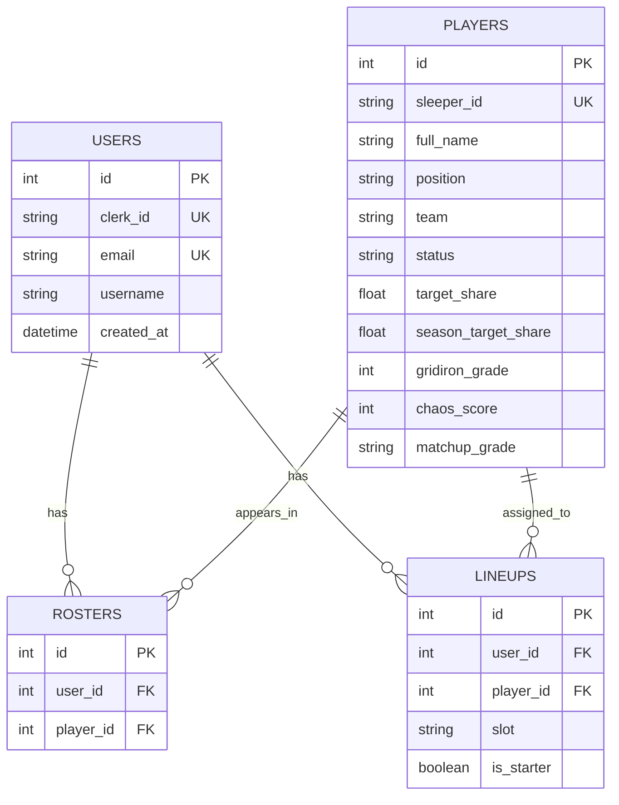

# Data Model Documentation

## Current entities

The database currently has four main tables:

- `users`
- `players`
- `rosters`
- `lineups`

The first migration is in:

```txt
backend/db/versions/192c278a7e4a_initial_tables.py
```

## Entity relationship overview



## `users`

Represents an application user.

| Column | Type | Notes |
|---|---|---|
| `id` | integer | Primary key. |
| `clerk_id` | string | Unique external auth id. Auth is not wired yet. |
| `email` | string | Unique. |
| `username` | string/null | Optional display/user name. |
| `created_at` | datetime | Defaults to current server time. |

Current development assumption:

- Backend roster and lineup routes use user id `1` through `DEV_USER_ID`.

## `players`

Represents NFL players imported from Sleeper.

| Column | Type | Notes |
|---|---|---|
| `id` | integer | Primary key. |
| `sleeper_id` | string | Unique Sleeper player id. |
| `full_name` | string | Player name. |
| `position` | string | Current skill positions include QB, RB, WR, TE, K in seed script; API excludes K. |
| `team` | string/null | NFL team or null/free agent context. |
| `status` | string | Defaults to active in the SQLAlchemy model; migration allows nullable. |
| `target_share` | float/null | Reserved for real data. |
| `season_target_share` | float/null | Reserved for real data. |
| `gridiron_grade` | integer/null | Reserved; current API computes mock grade instead. |
| `chaos_score` | integer/null | Reserved; current API computes mock score instead. |
| `matchup_grade` | string/null | Reserved; current API computes mock grade instead. |

## `rosters`

Join table between user and player.

| Column | Type | Notes |
|---|---|---|
| `id` | integer | Primary key. |
| `user_id` | integer | FK to `users.id`. |
| `player_id` | integer | FK to `players.id`. |

Current API prevents duplicate roster entries in code, but there is no database-level unique constraint in the initial migration.

Recommended future constraint:

```txt
unique(user_id, player_id)
```

## `lineups`

Stores a user's current lineup assignments.

| Column | Type | Notes |
|---|---|---|
| `id` | integer | Primary key. |
| `user_id` | integer | FK to `users.id`. |
| `player_id` | integer | FK to `players.id`. |
| `slot` | string/null | Current frontend uses `QB`, `RB1`, `RB2`, `WR1`, `WR2`, `FLEX`, `TE`, `BN`. |
| `is_starter` | boolean | True unless slot is `BN` in current frontend behavior. |

Current API replaces the entire lineup on save.

Recommended future constraints:

- unique `(user_id, player_id)` to prevent the same player appearing twice;
- slot validation at the API/schema level;
- optionally unique active starter slot per user for non-bench slots.

## Current data seed flow

`backend/scripts/seed_players.py`:

1. Calls Sleeper NFL players endpoint.
2. Filters to relevant positions: `QB`, `RB`, `WR`, `TE`, `K`.
3. Skips entries without name or position.
4. Keeps active/inactive players and some free-agent/team cases.
5. Inserts `Player` rows.

The seed script does not currently perform upserts or duplicate protection beyond the database unique constraint on `sleeper_id`.

## Manual dev user creation

The uploaded SQL session includes:

```sql
INSERT INTO users (clerk_id, email, username)
VALUES ('dev_user', 'dev@gridironlabs.com', 'DevUser');
```

This is required for current `DEV_USER_ID = 1` roster and lineup routes to work locally.

## Data model improvement roadmap

1. Add uniqueness constraints for roster and lineup rows.
2. Normalize grade inputs into separate weekly/player metrics tables once real data exists.
3. Add league/team/roster concepts if the app supports imported fantasy leagues.
4. Add week/season context to lineup and scoring data.
5. Decide whether `Lineup` represents only the current saved lineup or historical weekly lineups.
6. Create explicit Pydantic schemas that match the database model intentionally, not accidentally.
